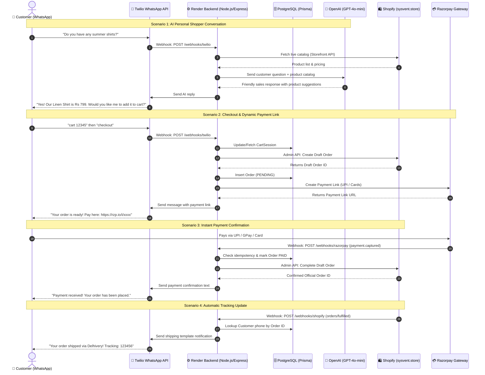

# 📱 WhatsApp E-Commerce Automation — Master Launch & Setup Guide

This guide is the single source of truth for the **WhatsApp E-Commerce Automation** platform built for **Sysvent** (`sysvent.store`). It explains every detail of the architecture, subscription requirements, exact remaining tasks, and step-by-step instructions to get the automation fully live.

---

## 📑 Table of Contents
1. [System Overview & How the Automation Works](#1-system-overview--how-the-automation-works)
2. [Full Architectural Flow Diagram](#2-full-architectural-flow-diagram)
3. [Technology Stack & Roles](#3-technology-stack--roles)
4. [Platform Subscriptions & Cost Analysis](#4-platform-subscriptions--cost-analysis)
5. [What Tasks Remain to Start This Automation](#5-what-tasks-remain-to-start-this-automation)
6. [Step-by-Step Setup for Remaining Tasks](#6-step-by-step-setup-for-remaining-tasks)
   - [Step 1: Free Sandbox Testing (Twilio)](#step-1-free-sandbox-testing-twilio)
   - [Step 2: OpenAI API Setup (The AI Sales Brain)](#step-2-openai-api-setup-the-ai-sales-brain)
   - [Step 3: Shopify API Credentials](#step-3-shopify-api-credentials)
   - [Step 4: Razorpay Payment Gateway & Webhook](#step-4-razorpay-payment-gateway--webhook)
   - [Step 5: Render Environment Variables](#step-5-render-environment-variables)
   - [Step 6: Going Live with Real WhatsApp & Meta](#step-6-going-live-with-real-whatsapp--meta)
7. [Testing & Verification Checklist](#7-testing--verification-checklist)
8. [Troubleshooting Common Issues](#8-troubleshooting-common-issues)

---

## 1. System Overview & How the Automation Works

This project transforms your WhatsApp number into an **AI-powered 24/7 conversational storefront and autonomous sales closer**. Customers can chat naturally, browse live products, add items to cart, receive instant checkout links, and track shipments—all without human intervention.

### Core Automation Capabilities:
- **AI Personal Shopper (OpenAI GPT-4o-mini):** Automatically reads your live Shopify catalog (up to 50 products). Answers customer questions, overcomes price objections, recommends products, and encourages purchases with conversational calls-to-action.
- **Direct WhatsApp Shopping Commands:** Supports instant keyword shortcuts:
  - `browse` → Displays formatted product catalog with prices and product IDs.
  - `cart <product_id>` → Creates or updates a customer cart session stored in PostgreSQL.
  - `checkout` → Computes cart totals, creates a Shopify Draft Order, generates a secure Razorpay Payment Link, and sends it to the chat.
- **Payment & Order Finalization (Razorpay Webhook):** When the customer pays the link via UPI, Card, or NetBanking, Razorpay immediately notifies the backend. The backend marks the order as `PAID`, finalizes the Shopify Draft Order into an official order, and sends a WhatsApp confirmation.
- **Shipping Notifications (Shopify Webhook):** When you fulfill an order in Shopify and add tracking details, Shopify alerts your backend, which immediately sends a WhatsApp tracking update to the customer.
- **Webhook Idempotency & Cart TTL:** Webhooks verify signatures and track event IDs in a `WebhookEvent` table to prevent duplicate charges or double fulfillments. Inactive carts expire automatically after 24 hours.

---

## 2. Full Architectural Flow Diagram



---

## 3. Technology Stack & Roles

| Technology | Role in System | Key Configuration / Endpoints |
| :--- | :--- | :--- |
| **Node.js & Express (TypeScript)** | Central server logic, command routing, webhook endpoints | Port `3000`, `/webhooks/*`, `/health` |
| **Prisma ORM (v6)** | Database schema management & type-safe queries | `prisma/schema.prisma` |
| **PostgreSQL (Render)** | Persistent storage for Customers, Carts, Orders, and Webhook Deduplication | `whatsapp-store-db` |
| **Twilio WhatsApp API** | Messaging gateway between WhatsApp users and the backend | Webhook: `/webhooks/twilio` |
| **OpenAI (GPT-4o-mini)** | Generative AI sales assistant answering inquiries with product context | `src/services/ai.ts` |
| **Shopify Storefront API** | Read-only access to live products, variants, and prices | GraphQL: `/api/2024-01/graphql.json` |
| **Shopify Admin API** | Draft order creation and order completion | REST: `/admin/api/2024-01/draft_orders.json` |
| **Razorpay SDK** | Dynamic payment link generation and webhook verification | Webhook: `/webhooks/razorpay` |
| **Render Cloud** | Hosts the web service and managed PostgreSQL database | Automated deployment via `render.yaml` |

---

## 4. Platform Subscriptions & Cost Analysis

| Platform | Subscription Needed? | Cost Structure | Purpose |
| :--- | :---: | :--- | :--- |
| **Twilio (WhatsApp)** | ❌ **No Monthly Fee** | **100% Free Sandbox** for testing.<br>Pay-as-you-go in production: ~$0.005/msg + standard Meta fees. | Receiving & sending WhatsApp messages |
| **OpenAI API** | ❌ **No Monthly Fee** | Pay-as-you-go: **$0.15 per 1 Million input tokens**.<br>A $5 credit deposit will cover ~20,000+ customer chats. | AI sales closer & personal shopper |
| **Razorpay** | ❌ **No Monthly Fee** | **Free Sandbox/Test mode**.<br>In Live mode: Standard ~2% transaction fee only when you make a sale. | Accepting UPI, Cards, NetBanking |
| **Shopify** | ✅ **Yes** | **Basic Shopify Plan**: ~$39/month (or ₹1,999/mo in India). | Storing products, orders, inventory |
| **Render** | ⚠️ **Optional for Testing** | **Free Tier** for development (sleeps after 15m inactivity).<br>**Production:** Starter Web ($7/mo) + Postgres ($7/mo) = $14/mo total. | 24/7 backend server & database |
| **Meta (WhatsApp)** | ❌ **No Monthly Fee** | Pay-per-conversation (24-hour window):<br>- Customer-initiated service chat: ~₹0.29 ($0.0035)<br>- Utility/shipping template: ~₹0.11 ($0.0014) | Official Meta WhatsApp API infrastructure |

> [!NOTE]
> **Total Monthly Operating Cost:** Only **~$14/month** (Render hosting) + actual usage pennies (OpenAI & Twilio). This saves you ~$300/year compared to platforms like Interakt or WATI!

---

## 5. What Tasks Remain to Start This Automation

Here is the exact checklist of what is complete vs what remains:

### ✅ Completed (Code & Infrastructure Ready):
- [x] Node.js/TypeScript Express server written, compiled, and deployed to Render.
- [x] Prisma PostgreSQL database models created (`Customer`, `CartSession`, `Order`, `WebhookEvent`).
- [x] Twilio WhatsApp service with lazy-client initialization (crash-proof).
- [x] OpenAI sales closer integration with live Shopify catalog grounding.
- [x] Shopify Storefront & Admin API client routines written.
- [x] Razorpay payment link generation & signature verification logic.
- [x] Webhook idempotency and cart 24-hour expiration implemented.
- [x] Render Blueprint (`render.yaml`) configured and deployed.

### ⏳ Remaining Tasks (Manual Credentials & Setup Required):
1. **Twilio Sandbox Opt-In:** Send the `join` code from your personal phone to Twilio's test number so Twilio forwards your messages.
2. **Configure Twilio Webhook:** Paste your Render URL into the Twilio Sandbox settings.
3. **Set Environment Variables in Render:** Provide real API keys for OpenAI, Shopify, Razorpay, and Twilio.
4. **Link Meta & Real Phone Number (When ready for public launch):** Unlink your business phone number from standard WhatsApp mobile app and connect it via Twilio.
5. **Add Shopify & Razorpay Webhooks:** Configure order fulfillment and payment captured webhooks in their respective dashboards.

---

## 6. Step-by-Step Setup for Remaining Tasks

Follow these steps in order to take your system from current state to fully functional:

---

### Step 1: Free Sandbox Testing (Twilio)

You do **not** need to buy a number or pay anything to test right now.

1. Log into your [Twilio Console](https://console.twilio.com/).
2. Navigate to: **Messaging** → **Try it out** → **Send a WhatsApp message** ([Direct Link](https://console.twilio.com/us1/develop/sms/try-it-out/whatsapp-learn)).
3. On the screen, you will see instructions like:
   - Twilio Number: `+1 415 523 8886`
   - Message code: `join <two-words>` (for example: `join silver-fox`)
4. Open WhatsApp on your phone and send that exact message (`join silver-fox`) to `+1 415 523 8886`.
5. Twilio will reply: *"You are all set to use the Sandbox"*.
6. Now, click the **Sandbox Settings** tab on the left side of the Twilio screen:
   - In the field **"WHEN A MESSAGE COMES IN"**, enter:
     ```text
     https://<YOUR-RENDER-URL>.onrender.com/webhooks/twilio
     ```
   - Set the HTTP method dropdown to **POST**.
   - Click **Save**.

---

### Step 2: OpenAI API Setup (The AI Sales Brain)

1. Go to [platform.openai.com](https://platform.openai.com/) and sign up or log in.
2. Go to **Settings** → **Billing** and add $5 in pre-paid credits.
3. In the left menu, go to **API Keys** → click **Create new secret key**.
4. Name it `Sysvent WhatsApp Bot` and copy the key (format: `sk-proj-...`).
5. Save this key for your Render environment variables.

---

### Step 3: Shopify API Credentials

To allow the bot to read your products and create draft checkout orders:

1. Log into your Shopify Admin (`https://admin.shopify.com/store/sysvent`).
2. Go to **Settings** (gear icon, bottom-left) → **Apps and sales channels** → **Develop apps**.
3. Click **Create an app** (name it `WhatsApp Store Automation`).
4. Under **Configuration**:
   - **Storefront API:** Enable `unauthenticated_read_product_listings` and `unauthenticated_read_product_inventory`. Click Save.
   - **Admin API:** Enable `read_products`, `write_draft_orders`, `read_draft_orders`, `write_orders`, `read_orders`, and `read_fulfillments`. Click Save.
5. Click **Install app**.
6. Reveal and copy:
   - **Storefront Access Token** (`SHOPIFY_STOREFRONT_ACCESS_TOKEN`)
   - **Admin API Access Token** (`SHOPIFY_ADMIN_ACCESS_TOKEN`, starts with `shpat_...`)
   - **Store Domain**: `sysvent.store` (or `your-store.myshopify.com`)

---

### Step 4: Razorpay Payment Gateway & Webhook

#### 4.1 Get API Keys:
1. Log into the [Razorpay Dashboard](https://dashboard.razorpay.com/).
2. For testing, ensure the toggle at the top is set to **Test Mode**.
3. Go to **Settings** → **API Keys** → click **Generate Key**.
4. Copy `Key Id` (`rzp_test_...`) and `Key Secret`.

#### 4.2 Set Razorpay Webhook:
1. Go to **Settings** → **Webhooks** → click **Add New Webhook**.
2. Webhook URL:
   ```text
   https://<YOUR-RENDER-URL>.onrender.com/webhooks/razorpay
   ```
3. Secret: Create any strong password (e.g. `SysventRazorSecret2026!`). Save this as `RAZORPAY_WEBHOOK_SECRET`.
4. In **Active Events**, check:
   - `payment.captured`
   - `payment.failed`
   - `payment_link.paid`
5. Click **Create Webhook**.

---

### Step 5: Render Environment Variables

1. Go to your [Render Dashboard](https://dashboard.render.com/).
2. Click your Web Service (`whatsapp-store-backend`).
3. Click **Environment** in the left sidebar.
4. Ensure all the following variables are filled in:

| Key | Example / Description |
| :--- | :--- |
| `DATABASE_URL` | *Auto-filled by Render PostgreSQL* |
| `PORT` | `3000` |
| `SHOPIFY_STORE_DOMAIN` | `sysvent.store` (or `sysvent.myshopify.com`) |
| `SHOPIFY_STOREFRONT_ACCESS_TOKEN` | *Token from Shopify Storefront App* |
| `SHOPIFY_ADMIN_ACCESS_TOKEN` | `shpat_xxxxxxxxxxxxxxxxxxxxxxxx` |
| `SHOPIFY_WEBHOOK_SECRET` | *Secret found at bottom of Shopify Webhooks page* |
| `RAZORPAY_KEY_ID` | `rzp_test_xxxxxxxxxxxx` |
| `RAZORPAY_KEY_SECRET` | `xxxxxxxxxxxxxxxxxxxxxxxx` |
| `RAZORPAY_WEBHOOK_SECRET` | *Password you chose when creating Razorpay Webhook* |
| `TWILIO_ACCOUNT_SID` | `ACxxxxxxxxxxxxxxxxxxxxxxxxxxxx` (from Twilio Console home) |
| `TWILIO_AUTH_TOKEN` | *Auth Token from Twilio Console home* |
| `TWILIO_PHONE_NUMBER` | `whatsapp:+14155238886` (for Sandbox) |
| `OPENAI_API_KEY` | `sk-proj-xxxxxxxxxxxxxxxxxxxxxxxx` |

5. Click **Save Changes**. Render will automatically restart with your live keys!

---

### Step 6: Going Live with Real WhatsApp & Meta

When you finish Sandbox testing and want your real business phone number on WhatsApp:

1. **Prepare Phone Number:** The number **cannot** be active on standard WhatsApp or WhatsApp Business mobile apps. (In WhatsApp on your phone, go to Settings → Account → Delete Account).
2. **Meta Business Account:** Create a portfolio at [business.facebook.com](https://business.facebook.com/) and verify domain `sysvent.store`.
3. **Sync Shopify Catalog:** In Shopify Admin, install the free **Facebook & Instagram** app. This syncs your products to Meta Commerce Manager and activates the native **Store** button in WhatsApp.
4. **Connect WhatsApp in Twilio:** In Twilio Console, go to **Messaging** → **Senders** → **WhatsApp Senders** → **Add New Sender**. Complete the Meta Embedded Signup to register your official business number.
5. **Update Render:** Change `TWILIO_PHONE_NUMBER` in Render from the sandbox number to your real approved number (e.g., `whatsapp:+91XXXXXXXXXX`).

---

## 7. Testing & Verification Checklist

Once your variables are in Render and you've joined the Twilio Sandbox:

1. **Test AI Sales Chat:**
   - Message: *"Hi, do you sell any kitchen gadgets or shirts?"*
   - Expected: AI replies conversationally, citing your actual Shopify products and prices.
2. **Test Browse Command:**
   - Message: `browse`
   - Expected: Returns your top products with title, price, and ID format.
3. **Test Cart Command:**
   - Message: `cart <ID>` (using an ID from the browse list)
   - Expected: *"✅ Added [Product Name] to your cart!"*
4. **Test Checkout:**
   - Message: `checkout`
   - Expected: Generates a Razorpay link with your total amount.
5. **Test Payment:**
   - Tap link and complete test payment.
   - Expected: Within seconds, WhatsApp receives *"Payment received successfully! Your order has been placed."*
   - Shopify Admin receives a new paid order.
6. **Test Shipping Update:**
   - Go to Shopify Admin → Orders → Fulfill item with tracking number.
   - Expected: WhatsApp receives shipping confirmation with carrier and tracking link.

---

## 8. Troubleshooting Common Issues

### Issue 1: WhatsApp does not reply at all
- **Cause:** Your personal phone has not joined the Twilio Sandbox.
- **Fix:** Send the `join <code-words>` text to `+1 415 523 8886`.
- **Cause 2:** Webhook URL in Twilio Sandbox settings is wrong.
- **Fix:** Verify it is `https://<YOUR-RENDER-URL>.onrender.com/webhooks/twilio` with method **POST**.

### Issue 2: Log shows "Twilio is not configured yet"
- **Cause:** `TWILIO_ACCOUNT_SID` or `TWILIO_AUTH_TOKEN` is missing in Render Environment.
- **Fix:** Copy the Account SID (starts with `AC`) from the Twilio Console homepage into Render.

### Issue 3: AI says "I'm sorry, my AI brain is currently offline"
- **Cause:** `OPENAI_API_KEY` is missing or out of credit.
- **Fix:** Check `platform.openai.com/billing` to ensure at least $5 credit is active and key is pasted into Render.

### Issue 4: Render Server is slow to respond on first message
- **Cause:** Free Render instances spin down after 15 minutes of inactivity.
- **Fix:** Upgrade the Render Web Service to the $7/month Starter plan so it stays awake 24/7.
