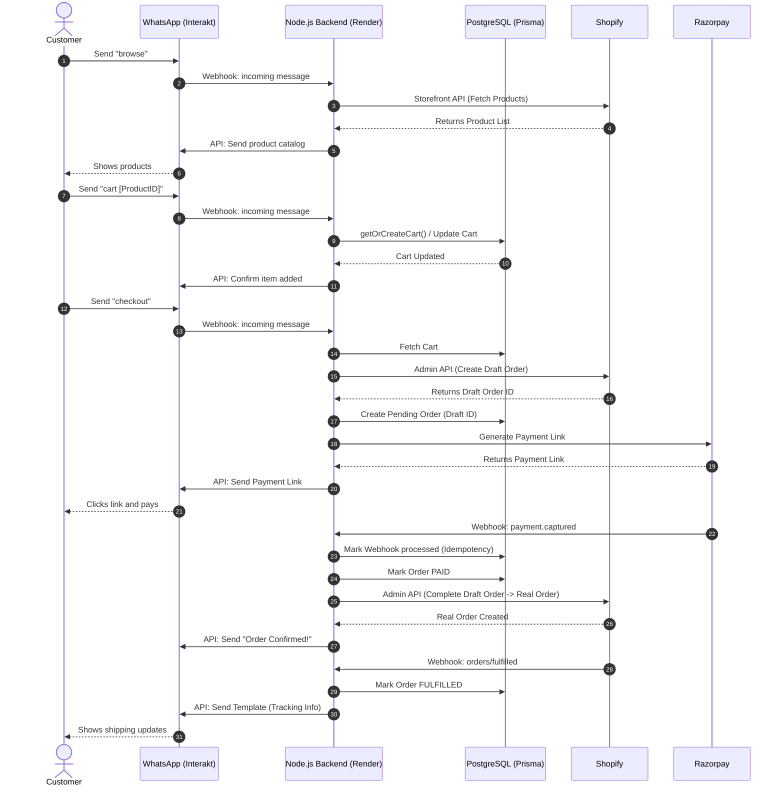

# WhatsApp E-Commerce Automation Backend

Welcome to the **WhatsApp E-Commerce Automation** project! This backend service transforms a standard WhatsApp business number into a fully automated, conversational storefront. It bridges the gap between conversational messaging (Interakt), e-commerce management (Shopify), and payment gateways (Razorpay).

## 🚀 Our Mission
To reduce friction in the buying process by meeting customers exactly where they spend their time: **WhatsApp**. By providing an instant, automated conversational flow, customers can browse catalogs, build carts, securely pay, and track fulfillments without ever leaving their chat app or talking to a human agent.

---

## 🛠️ Tech Stack
- **Runtime & Language:** Node.js, Express.js, TypeScript
- **Database ORM:** Prisma (v6)
- **Database Engine:** PostgreSQL (Hosted on Render)
- **WhatsApp BSP:** Interakt
- **E-Commerce Backend:** Shopify (Admin API & Storefront API)
- **Payment Gateway:** Razorpay
- **Hosting:** Render (Web Service & Managed PostgreSQL)

---

## 🏗️ Architecture & Flow Diagram

The system operates entirely via webhooks and API calls, maintaining a stateless server architecture where all state is persisted in PostgreSQL.

---

## ⚙️ Detailed Workings

### 1. Conversational Commands (Interakt)
The application parses incoming text messages via the `/webhooks/interakt` endpoint.
- **`browse`**: Queries the Shopify Storefront GraphQL API to fetch the first 10 products and their pricing, formatting them cleanly into a WhatsApp message.
- **`cart {product_id}`**: Retrieves the customer's phone number, finds or creates a `Customer` and `CartSession` in PostgreSQL, adds the item, and recalculates the total. 
- **`checkout`**: Validates the cart, uses the Shopify Admin REST API to create a `Draft Order`, generates a secure checkout link via the Razorpay API, and messages the link to the user.

### 2. Idempotency & Reliability
Webhook delivery is notoriously unpredictable (retries, timeouts, duplicate events).
- **Idempotency Check**: The `WebhookEvent` table tracks every `id` (e.g. `payment.id` or `x-shopify-webhook-id`). If a webhook arrives twice, it is safely ignored.
- **Asynchronous Processing**: All heavy tasks (like updating Shopify or querying the DB) happen *after* the backend immediately returns an HTTP `200 OK`. This prevents external services from timing out and needlessly retrying the webhook.

### 3. Cart Time-To-Live (TTL)
To prevent stale inventory or outdated pricing, the database implements a soft TTL on carts. When a user interacts with their cart, the system checks the `updatedAt` timestamp. If the cart is older than 24 hours, it is seamlessly cleared before processing the new request.

### 4. Webhooks & Verification
- **Razorpay `/webhooks/razorpay`**: Uses `crypto` HMAC verification to ensure the webhook legitimately originated from Razorpay. Listens for `payment.captured` (triggers Shopify order completion and sends the customer a success message) and `payment.failed` (alerts the customer to try again).
- **Shopify `/webhooks/shopify`**: Verifies the HMAC signature. Listens for `orders/fulfilled`. When an order is shipped by the merchant, it triggers Interakt's **Template Message API** to securely deliver the tracking number and URL to the customer, even if they haven't replied to the bot in over 24 hours.

---

## 🔒 Security & Deployment Notes
- **Secrets Management**: No API keys are hardcoded. Everything is injected via environment variables (`.env` locally, Render dashboard in production).
- **TypeScript**: The strict type system prevents runtime crashes and ensures payload accuracy across the three different external APIs.
- **Prisma Schema**: Enforces unique constraints and foreign key relations ensuring absolute data integrity between Customers, Orders, and Webhook Events.

## 🏃‍♂️ Getting Started Locally
1. Run `npm install`
2. Configure your `.env` file using the keys provided by Shopify, Razorpay, and Interakt.
3. Run `npx prisma db push` to initialize your local database schema.
4. Run `npm run dev` to start the local server.
5. Use a tool like **ngrok** to tunnel your local port `3000` to the internet to receive live webhooks during testing!
